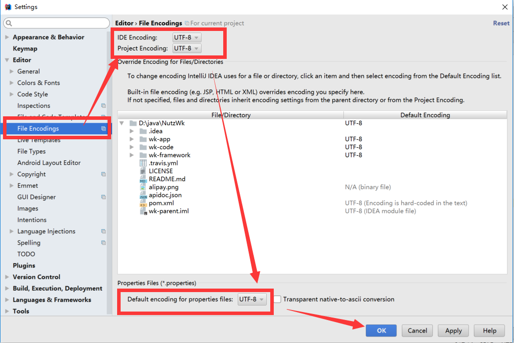

## 运行环境

* JDK 1.8 以上

* Maven 3.5.x 以上

* Tomcat 8.5.x 以上或 Jetty 9.3.x 以上

* MySQL 5.5 以上或 Oracle 、SqlServer 等数据库

## IDEA构建

IDEA --> File --> Open ，选择项目所在文件件夹，是“打开项目”，而非导入项目！！是“打开项目”，而非导入项目！！是“打开项目”，而非导入项目！！

## IDEA配置

File > Settings > File Encodings > All UTF-8

##  IDEA插件安装`可选`

File > Plugins 
安装lombok

